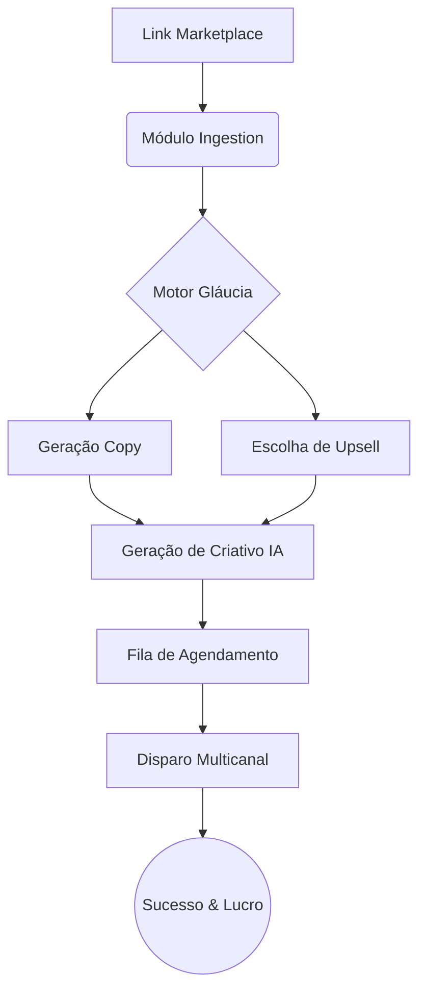

# Workflow em Ação: O Caminho de uma Oferta 💅

Este guia simula como o sistema processará um "achadinho" do início ao fim.

---

### 1. Entrada (Input)
O usuário (ou o robô de espelhamento) fornece um link:
> **URL**: `https://shopee.com.br/vestido-floral-verao-123456`

### 2. Processamento SIAP (Bastidores)
- **Ingestion**: Extrai o nome (**Vestido Floral**), Preço original (**R$159,90**), Preço Oferta (**R$47,90**) e calcula o desconto (**70% OFF**).
- **Affiliate Bridge**: Transforma o link em: `https://shope.ee/afiliado_glaucia_123`.

### 3. O Carisma da Gláucia (Brain)
O **Motor de Persona** recebe os dados e gera o copy:
> "🚨 **MIGA, PARA TUDO!** 🚨  
> Eu vi esse vestido na vitrine do shopping por quase 200 reais e quase caí pra trás quando achei por **R$47,90**! 😭  
> É a cara da riqueza e o preço de um lanche!  
>  
> 💸 **70% OFF**  
> 🔗 Compre aqui: [Link Afiliado]  
>  
> *P.S: Miga, comprou o vestido? Já clica aqui pra aprender a fazer as melhores combinações no Curso de Estilo:* [Link Hotmart]"

### 4. Criação do Sticker (Visual)
O **Imagen 3** gera uma arte (Sticker) da Gláucia segurando uma sacola com o texto "ACHADINHO!" em rosa e dourado.

### 5. Disparo Inteligente (Dispatcher)
O agendador percebe que são 18:00 (Hórario de Pico).
- Envia para o **WhatsApp** (Evolution API) com variação de caracteres para evitar ban.
- Envia para o **Telegram** instantaneamente.

---

## 🏗️ Como o Bot funciona por dentro?

